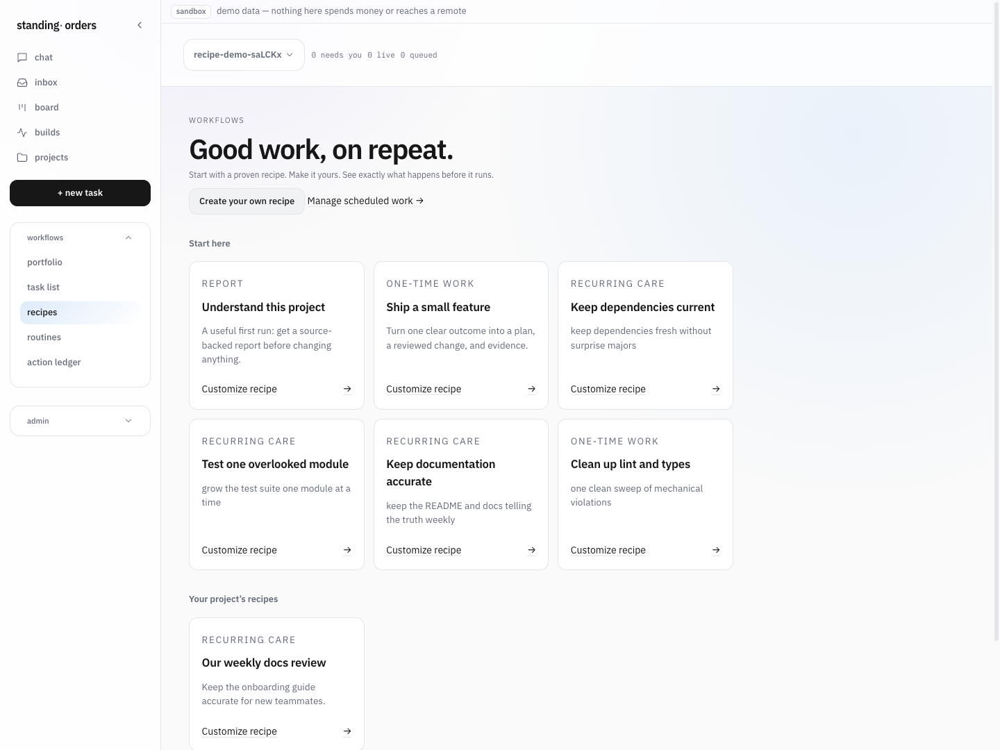
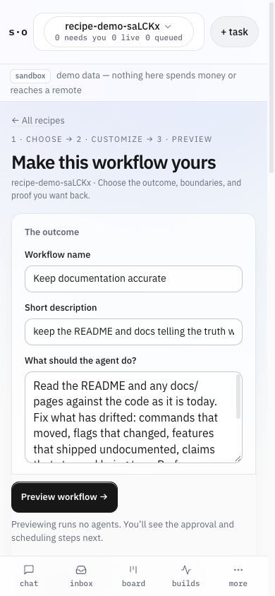

# Workflow recipes

Open **Recipes** in the console, choose a starter, customize its outcome, and
preview the work before creating it. Recipes use the same tasks, scope approval,
planning, evidence, review, scheduler, and recovery paths as other work.

## Your first workflow

1. Open a project. **Understand this project** is a useful first run: it asks
   for a source-backed report and excludes code changes. Other starters cover a
   small feature, dependencies, test coverage, documentation, and lint/types.
2. Describe the result you want, what to leave alone, and any allowed paths.
   Keep the supplied success checks or specify your own evidence. Code workflows
   can plan first; repeating work reuses a previously approved scope.
3. Choose **Run once** or a daily, weekly, or interval schedule. Repeating work
   supports an optional rolling seven-day dollar cap and runs one instance at
   a time. Exact cost-reporting capability is checked at routine approval.
4. **Preview workflow** shows the steps, scope, proof, schedule, and current
   project/agent/worker setup. Previewing starts no agents.
5. Create the task or scheduled workflow. A matching signed policy can approve
   a one-time task filed by its signed-in signer. Otherwise approve the scope
   on the task page. A new repeating workflow always needs its own routine
   approval, including the exact agents. Existing publication authority still
   applies separately.

Work can be created while a worker is offline; the preview explains that it
will wait. The created task/routine page remains the place to inspect evidence,
handle decisions, stop/resume work, or pause a schedule. The recipe library
links the twelve most recent workflows to those same durable records.

## Reuse and share

**Save as a project recipe** saves the exact preview without creating work.
People with access to that project can reuse it; viewers can browse but cannot
save or launch. Saved copies are immutable. To change one, customize it and
save a new copy. The library shows the newest 100 saved copies.

A task's **Reuse this scope as a recipe** link copies its goal, exclusions,
allowed paths, and acceptance criteria into the editor. This is a new work
definition: dependencies, credentials, approvals, provider settings, budgets,
and publication grants are not copied. Review the new project's policy before
creating work.

**Export recipe JSON** creates a portable version-1 work definition. Paste it
under **Import a shared recipe** in another project to customize and preview
it there. Imports carry no project identity, permissions, credentials, or
approval authority; unsupported fields and versions are rejected. The text
you explicitly put in goals, checks, and exclusions is included in the export.

## Creation and recovery guarantees

Previews are stored on the server for 30 minutes and bound to the actor,
canonical project, and a digest of the exact definition. Editing makes a fresh
preview. Creating work atomically records the task/routine, optional existing
policy approval, launch receipt, and action-ledger event. Retrying the **same
preview** after a double click, lost response, or controller restart returns
the same work. Deliberately making a new preview can create another workflow.
An expired preview cannot create new work; existing receipts remain replayable.

Every mutation rechecks current project access. Cookie requests also require
CSRF and the current open-project revision. Unknown JSON fields, disguised
text, malformed schedules, unsupported evidence, oversized documents, and
excess success checks are refused. There are at most 30 unused, unexpired
previews per actor.

Recipes add schema 56's `workflow_recipe` and `workflow_preview` tables. The
migration preserves prior data. A database already marked current but missing
its recipe/receipt tables is refused instead of silently recreating history.
Back up and follow the existing coordinated controller upgrade process; older
workers must not write a newer schema.

## Current boundaries

This is a guided layer over the existing work engine. It does not add arbitrary
conditional branches, external service triggers, credentials in templates, or
a second execution engine. Report recipes and workflows requiring a fresh
plan run once; repeating workflows produce code changes from approved scope.
Saved recipe editing creates a new copy rather than modifying running work.

Readiness is a current configuration summary, not an execution certificate.
The scheduler and worker recheck actual authority, availability, budget,
containment, and completion requirements at their existing boundaries.
