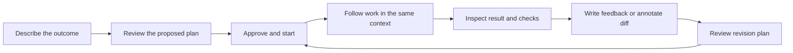

# Standing Orders: one workspace from request to result

Date: September 13, 2026. Status: **packages 0–2 and the user's added concise-UI pass are implemented, verified, and merged into main; package 3 is implemented on branch `standing-orders/workspace-3-result-review-20260913` and awaits independent inspection; packages 4–5 remain planned**. The installed app is not updated by this merge. The baseline findings below describe the state when this plan was written; gates are recorded in [the packages 0/1 execution record](WORKSPACE_0_1_EXECUTION_2026-09-13.md), [the package 2 independent acceptance](WORKSPACE_2_INDEPENDENT_REVIEW_2026-09-13.md), and [the package 3 result](WORKSPACE_3_RESULT_REVIEW_2026-09-13.md).

## 1. The outcome

A person should be able to describe work, approve a clear plan, leave, return to a reviewable result, and request changes without figuring out our internal task/build/proof machinery. Chat is the front door; structured views remain available when they are more useful than conversation.

This is a cohesion pass over existing capabilities, not a new orchestration engine. A prettier screen is insufficient: status must be truthful, input must survive updates, and the finished work must be easy to inspect.

The six recommendations this plan implements are: continuous conversation; less visible explanation; result-first review; simpler navigation; stable, lightweight interaction; and trustworthy status/recovery language.

## 2. What exists today — and which version we mean

There are three different baselines. Do not treat them as interchangeable.

| Baseline | Actual state | How this plan uses it |
| --- | --- | --- |
| Installed console | Older running version. The installation records also contain unresolved background-project-access acceptance. | Release destination, not evidence that local improvements are already live. Recheck its identity and access before any update. |
| Main working checkout | HEAD `45ad5a70e1c4b4435d663066e3c9d7c329513c00`, with substantial existing uncommitted installation, recovery, and phone-continuity work. | Preserve all existing work. Compare explicitly before integration; never reset or overwrite the checkout. |
| Reviewed UI candidate | Standing Orders builds 1540 and 1541; final revision `d12d776897e3d4a0bb329737e8f09f624285f467`. Based on snapshot `b1290a74795761d070f14993a789980ff849c71e`, not clean main alone. | Starting UI baseline after the verification discrepancy is resolved. Retain its improvements rather than rebuilding them. |

The candidate passed an independent 75-check browser exercise with 21 viewport screenshots, typechecking, and 299 focused tests. The worker's parallel full suite passed. However, its **exact repository-approved serial verifier failed twice**: the persistent database-lock test exceeded its 10-second assertion (12,165 ms, then 11,894 ms). A targeted rerun passed, but the cause is not established. The result is implemented, **not release-verified, merged, or deployed**.

The inspected UI was assessed at 8/10 on an internal design rubric. That is not a product-wide reliability score or measured parity with Stripe, Ploy, or ChatGPT. See [the independent review](UI_POLISH_REVIEW_2026-09-13.md).

### Keep what is already working

- Task-focused chat already reuses task facts, signed scope, decisions, results, and control actions.
- Overview/Ask, normal revisions, and diff-annotation revisions already exist.
- Chat sends have durable request receipts preventing duplicate provider dispatch on replay.
- Drafts survive supported reloads within the same browser tab; the pending composer stays editable.
- The UI candidate fixes fresh-desktop composer clipping, mobile project-menu positioning, and the annotation limit mismatch.
- Screenshot thumbnails, reduced-motion handling, optional project context, and calmer surfaces already exist in the candidate.
- The existing two quality modes, subscription routes, permissions, exact approvals, recovery controls, and publication authority remain intact.

### Concrete remaining gaps found in code

- `shell()` still presents Chat, Inbox, Board, Builds, Projects, plus Workflows/Admin groups; mobile has five separate tabs.
- `taskChatFocus()` is already a lens over `taskViewData()`, but separate rendering paths repeat status, context, and actions.
- `completionReceiptCard()` says **What shipped** even when the result is only saved locally. Proof, operator acceptance, and publication are separate facts elsewhere.
- `CHAT_CONTINUITY_SCRIPT` polls a version and uses `location.reload()` for new replies. It delays that reload while an input is focused; it does not yet deliver seamless transcript updates while typing.
- Task progress may show a raw `done` badge alongside an evidence problem. “Proof correction needed” is too abstract for the main explanation.
- Current artifact serving supports validated inline screenshots; other evidence is downloaded as text. There is no general trusted live-app-preview host to reuse.
- The candidate carries about 163 KB of inline CSS per page. Measured HTML responses were about 181–199 KB, uncompressed. Calculated gzip size is not actual transferred size.

## 3. Current experience → intended experience

| Area | Today | End state |
| --- | --- | --- |
| Starting work | Chat, new-task form, repeated guidance, five starters compete for attention. | One composer, one useful sentence, at most three contextual starters. “New task” opens conversational capture; “Use a form” preserves direct entry. |
| Orientation | Several navigation/context layers; project scope and task focus require interpretation. | Three primary destinations: **Chat · Work · Projects**. One project selector. Focused tasks visibly name their project and task. |
| Planning | Existing rich proposals and exact approval forms, but long stacked cards. | A concise plan summary, one Review plan action, then a focused approval surface with exact terms and Approve & start. |
| Execution | Journey card, badges, phase details, and separate build views overlap. | One current-status line, latest meaningful activity, and the relevant next action. Technical details are optional. |
| Result | Receipt, proof labels, counts, and review links compete with the deliverable. | Actual result first, short summary second, checks/caveats next. Files, diff, and logs are reachable without leaving the work context. |
| Revision | Both revision paths work but feel like separate flows. | Write feedback or annotate a diff; both produce a visible revision brief linked to the exact original result. |
| Continuity | Draft protection exists, but new replies can require a page reload or leaving a field. | New messages/status arrive without stealing focus, replacing input, moving the reader, or duplicating work. |
| Phone | Good viewport fixes, but dense chrome and no physical-keyboard acceptance yet. | Three bottom destinations, compact header, comfortably sized controls, keyboard-safe composer, and deliberate full-screen detail views. |
| Trust | Internal completion words leak into the experience. | “Changes saved,” “Checks failed,” “Ready to review,” “PR opened,” and “Merge observed” are evidence-backed, distinct claims. |

## 4. The exemplary end-to-end journey

Use one real, bounded UI task as the first demonstration: **“Make the mobile project switcher easier to use.”** Its exact acceptance criteria will be agreed before it runs.



### What the user sees at each step

1. **Describe.** “What do you want to get done?” above a clear composer. Starter examples: “What needs me?”, “Show active work”, “Plan a change”. Empty project state instead makes **Add project** the primary action. If chat is not configured, show its actual setup step, not a dead composer.
2. **Clarify.** Ask only about a choice that materially changes scope, authority, or the deliverable. An ambiguous project gets a project choice; routine reversible details use the current defaults. Do not invent an entire required questionnaire.
3. **Review.** Show a short goal, intended changes, how success will be checked, and important limits. Expanding Review plan reveals the exact signed scope, exclusions, paths, criteria, agent route, permissions, and publication terms. Approval stays bound to the current digest and existing authentication ceremony.
4. **Run.** Show “Building”, “Running checks”, a real question, or the actual wait reason. Indicate what was last observed and when. Do not fabricate a percent complete or estimated finish time. The composer remains usable for a draft; sending/steering semantics remain explicit.
5. **Return.** The same task displays its deliverable: phone screenshots for this example, a report for investigation, or a concise change summary plus diff/checks for backend work. The result identifies its run and revision. A failing check is shown before any readiness claim.
6. **Revise.** “The menu still feels cramped” opens a proposed revision brief. Alternatively, annotate the affected lines. Both preserve the original result, feedback, scope, and base revision; approving the revision starts a new, linked attempt through the existing workflow.
7. **Finish or publish.** Review completion, publication, and deployment remain separate. Opening a PR is not a merge; a merge is not deployment. Publishing requires the existing authorization and an observed result. If deployment is not observed, say so.

Task focus is a view of the existing unified conversation, not a new per-task chat engine. Do not imply that historical messages have been partitioned by task when they have not. Explicit task focus and links to canonical task/run records provide continuity without fabricating new transcript history.

## 5. Navigation and layout decisions

### Navigation mapping

| Existing destination | New place | Compatibility |
| --- | --- | --- |
| Chat | Chat | `/chat` remains valid. |
| Inbox / waiting decisions | Work → Needs you | Existing inbox/decision URLs still work and select Work in the shell. |
| Board / queue / task list | Work → All, with List/Board and status filters | Preserve ordering, dependencies, holds, and current URLs. Do not equate queued with running. |
| Builds / done / review | Work → Running or Completed; detailed attempts inside the selected task | Old run and review links remain valid, including selected-result deep links. |
| Projects | Projects | Keep the prominent Add project action and current enrollment checks. |
| Recipes / routines / portfolio / ledger | Work's secondary menu | Preserve specialist tools; they are not permanent top-level navigation. |
| Fleet / requirements / people / operating mode / system | Settings sections | Do not widen role or project visibility by moving a link. |

Work starts at All unless the user has chosen another view. Needs you, Running, and Completed are shortcuts over the same facts, not new persisted workflow states. Cancelled, paused, queued, and failed work remain findable in All. Weak or conflicting evidence is not silently classified as successful completion; an explicit exception stays visibly labeled.

**Desktop:** retractable sidebar, compact project selector, readable central conversation. A result/detail panel opens beside it when space permits, otherwise as a full-width view. Only one auxiliary panel is open at a time. Keep ordinary task details directly accessible; rename Ask/Overview consistently to Chat/Details if the prototype confirms those labels.

**Phone:** compact project/task header and Chat/Work/Projects bottom navigation. Result, diff, and plan detail open as full-screen views with a clear Back action; Back restores the prior draft and reading position. Settings is a header/menu action, not a fourth primary tab. Bottom navigation yields space during text entry where keyboard behavior permits. Implement against observed Safari behavior, not viewport-height guesses.

**Scope changes:** selecting another task or project never silently submits a draft, changes a signed scope, or expands admitted projects. Old task drafts stay associated with their original task. The visible focus must match the context sent to the model.

### Visual and writing rules

- Use the existing typography and tokens, refined consistently. Quiet solid surfaces for conversation, plans, and results; restrained glass for navigation and overlays only.
- Prefer whitespace and dividers to nested cards. Rich cards represent an actionable plan, decision, or result—not every paragraph.
- One visually dominant action per active state. Destructive, advanced, and secondary actions remain available with appropriate labels.
- Reduce repeated introductory/reassurance copy by roughly half against the fixed baseline. This is an editing target, not a quota that removes necessary terms or errors.
- Use neutral status text with small semantic indicators; never rely on color alone or cover routine waiting states in large yellow panels.
- Reuse the candidate's short transform/opacity transitions, at most 200 ms. No animated layout, blur, looping decoration, or new animation dependency. Reduced motion removes nonessential movement.
- Keep 16 px editable text on phones and approximately 44 px effective touch targets. Wrap titles and controls; allow horizontal scrolling inside a diff, not across the whole page.

## 6. A truthful status contract

Implement a shared presentation projection from existing records. Do not create a parallel lifecycle or let assistant prose determine status.

| Evidence/state | Main wording | Primary action |
| --- | --- | --- |
| Plan requires approval | Ready for your approval | Review plan |
| Approved; actual worker owns an active run | Building / Running checks, as recorded | View activity; Stop remains readily accessible |
| Worker unavailable | Waiting for your computer | Show the specific connection/access step |
| Dependency failed or cancelled | Waiting for “[task title]”, which did not finish | Review that task; alternative dependency actions are secondary |
| Required checks failed | Changes saved, but checks failed | Review failed check; offer existing repair path only when applicable |
| Required evidence absent | Result saved; verification still needed | Review missing evidence |
| Evidence only agent-reported | Result saved; checks reported by the agent | Review result, with source qualification |
| Required checks/criteria verified for this result | Ready to review | Review result |
| User accepted a weak result | Accepted with an exception | Review the recorded exception; never relabel checks as passed |
| PR created / merge observed | PR opened / Merge observed | Open the recorded PR |
| Deployment not observed | Deployment not confirmed | No fabricated deployed badge |

An automatic-recovery message must name an actual recovery record and state. Show “Retrying…” only while that is true; show the next recorded retry time when available. If there is no automatic repair path, state the user action plainly. Browser reconnect never implies worker recovery, and a stopped computer cannot be revived by copywriting.

Example for our actual verifier failure: **“Changes are saved. A database-lock check failed, so this result is not verified yet.”** A detail view contains the exact check, log, duration, and retained attempt. Do not claim that the UI change caused the failure before diagnosis.

## 7. Implementation sequence: six bounded Standing Orders packages

These are prepared work packages, **not filed or approved tasks**. Execute sequentially after plan approval because most touch the same UI module. Each package gets its own explicit scope, branch, acceptance criteria, and evidence. Do not let an unrelated problem silently expand its scope.

### Package 0 — resolve the verification discrepancy and establish the base

**Change:** move from “UI-tested but repository gate failed” to a reproducibly verified integration candidate.

**Work:**

1. Reproduce the exact approved command in the worker's context and compare with the passing direct context. Record Node version, launch mode, monotonic and wall time, contention behavior, and relevant load without dumping credentials or all environment variables.
2. Diagnose whether the defect is lock-wait implementation, test synchronization, scheduling, or the runner environment. Make the narrow fix supported by the evidence.
3. Preserve finite lock refusal, zero transaction-body execution on refusal, zero partial writes, and recovery after lock release. Do not simply increase the assertion, skip the test, change the verifier, or override the proof verdict.
4. Reconcile the UI candidate with main's dirty baseline in an isolated integration branch. Keep the original evidence and snapshot ancestry; inspect overlap with work done since the snapshot.

**Likely scope:** `src/store-contention.test.ts`, `src/store.ts` only if implicated, and the exact runner/test seam identified during diagnosis. Approve additional files before modifying them. UI baseline reconciliation is reviewed separately from the defect fix.

**Gate:** targeted contention scenarios pass repeatedly; the unchanged approved command passes on the candidate in the actual worker context on two consecutive runs:

```sh
npm run typecheck && npm test -- --run --reporter=dot --no-file-parallelism && npm run build
```

The extra repetition is justified by the two observed timing failures, not a permanent new workflow stage. New UI implementation waits for this gate. Release installation/access remains a separate gate.

### Package 1 — one navigation shell and one status vocabulary

**Change:** existing pages become a recognizable workspace without changing their underlying operations.

**Work:** implement Chat/Work/Projects; map the old pages and deep links to that shell; group Work by existing state/diagnosis; unify task/result status language; remove premature “shipped” and duplicate completion claims. Apply the basic surface, spacing, typography, and action hierarchy to these touched areas.

**Likely scope:** `src/serve.ts` (`shell`, `Chrome`, navigation maps, Work views, task/receipt headings), `src/dispatch.ts` for shared human-readable diagnosis where needed, focused renderer/navigation/dispatch tests. A small pure presentation helper is acceptable if it avoids duplicating logic; no new store table.

**Gate:** each old destination and bookmarked result opens correctly; project/role visibility is unchanged; same task/run has compatible status in Chat, Work, Details, and Review. Fixtures include raw done plus failed checks, manual acceptance, missing evidence, queued work, and cancelled work. Deliver desktop and phone screenshots, including empty and populated Work.

### Package 2 — continuous chat, planning, and approval

**Change:** the user can get from a request to approved running work without a context reset or a long order form.

**Work:**

- Consolidate entry copy and starters; preserve explicit form entry as an alternative.
- After the existing task/proposal confirmation, make its task focus and next step obvious in the same conversation. Do not merge “create a task” and “authorize execution” into an unsafe single implicit action.
- Render a concise plan summary and a focused exact-terms approval view. Reuse the existing scope digest, nonce, consent checks, and POST endpoint. Changed terms invalidate stale approval.
- Extend the existing read-only refresh mechanism to fetch server-rendered transcript/action fragments with stable message/proposal/task identities. Update only safe regions; keep native POST fallbacks. No second transport engine, WebSocket service, or framework rewrite.
- Preserve draft text, selection/focus, scroll anchor, open details, and current result selection. If the reader is above the latest message, show a small New update action instead of scrolling them down.
- Never swap a live password/approval form out from under the user. A changed scope gets a visible review-required indication and a user-initiated refresh of the secure terms.

**Likely scope:** `src/serve.ts` (`matePage`, `taskChatFocus`, `taskChatApproval`, task-status/message fragments, proposal return links), `src/chat-continuity.ts`, continuity and focused server tests; `src/mate.ts` only if a demonstrated request/context binding defect requires it.

**Gate:** send once, lose response, reconnect, and reload without another model call or task creation. Receive a reply while typing without loss or focus theft. Switch between two task contexts without sending to the wrong one. Stale scope, expired/revoked session, disabled storage, and no-JavaScript paths refuse or degrade honestly. The approved plan matches the actual dispatch authority exactly.

Unsent drafts remain same-tab storage with the existing expiry; no cloud draft sync or promise of survival after closing the tab. Durable sent messages/results can be reopened from another authorized device through existing access.

### Package 3 — result-first review and one revision loop

**Status (2026-09-13):** implemented on `standing-orders/workspace-3-result-review-20260913`; see [the package 3 result](WORKSPACE_3_RESULT_REVIEW_2026-09-13.md) for what changed, the browser proof, and the limitations. Not yet independently inspected, merged, or installed.

**Change:** the deliverable becomes the center of the experience, with regular feedback and annotations as two entrances to the same existing revision workflow.

**Work:**

- Share result rendering across task chat, run detail, and review cockpit using `CompletionReceiptView`, verified artifacts, the criterion matrix, and publication records.
- Present the result appropriate to its type: validated screenshots for UI; escaped report content/download for investigations; concise change summary, files, diff, and checks for backend changes. Show missing or truncated evidence explicitly.
- Keep Summary / Changes / Checks as local result views, with build logs and machine details subordinate. On desktop open beside chat when space allows; on phone use a dedicated view with reliable Back restoration.
- Put Request changes beside the result. Keep normal feedback and line annotations, the existing 500-character note contract, annotation batches, and the exact original run/base lineage.
- Summarize the proposed revision before approval; show the link from original result to revision and back. Preserve original evidence even after the revision succeeds.
- Publication remains explicit and observed; do not introduce automatic merge/deployment as a side effect of “looks good”.

**Likely scope:** `src/serve.ts` (`completionReceiptView/Card`, `runPage`, `reviewCockpitDetail`, `reviewDiffHtml`, existing revision handlers), `src/review-context.ts` only for a demonstrated lineage gap, related server and review-context tests.

**Gate:** the same run/head, checks, caveats, and publication state appear in each view. Normal and annotated feedback each create exactly one correctly linked revision through their existing paths. Missing/corrupt artifacts do not render as verified. Refresh, back navigation, and a failed submission preserve feedback.

**Preview limit:** no new live-preview hosting platform in this body of work. Current arbitrary HTML/text artifacts must not become executable same-origin pages. Use validated screenshots and safe text/downloads; link to an existing authorized preview if one is actually available. Rich interactive preview hosting is a later, separately scoped capability.

### Package 4 — phone, accessibility, motion, and delivery weight

**Change:** the exemplary journey feels consistent and stable across devices, not merely attractive in one screenshot.

**Work:** apply the shared design rules to all states of the journey; remove remaining nested decoration and repeated copy; consolidate overlapping CSS overrides; finish focus return, safe-area handling, and keyboard-aware layout. Keep functional drafts/status updates independent of animations.

Measure cold and warm transfer on identical fixtures. Prefer extracting shared styles into a versioned, cacheable static asset and compressing that nonsensitive asset using existing tooling. Authenticated HTML/fragments remain private/no-store; do not cache credentials or nonce-bearing pages, or casually enable compression of secret-bearing responses. Keep CSP and MIME protections. Do not add a new frontend build system to save these bytes.

**Likely scope:** `src/serve.ts`, `src/chat-continuity.ts`, the existing proof/fixture scripts, narrowly scoped static-style delivery code and packaging changes if needed.

**Gate:**

- Exact viewport screenshots at 320, 390, and 430 px phone widths; fresh empty chats at 1280×800 and 1440×900 independently. Also populated chat, approval, long task title, Work, result, diff annotations, and navigation overlays.
- Zero document-level overflow, overlap, hidden primary controls, or composer covering messages. Diffs may scroll within their own labeled region.
- Keyboard-only operation, focus restoration, reduced motion, readable status contrast, and 200% zoom/reflow checked. No global keyboard shortcut captures Space or text while editing.
- Real iPhone Safari: keyboard open/close, predictive-text area, rotation, browser chrome, safe areas, background/foreground, and Back. Browser emulation is not a substitute.
- Establish local interaction timing on a declared test device. Initial target: p95 local open/toggle/send acknowledgement under 200 ms, excluding model response and network latency. Report actual measurements, not a universal device guarantee.
- At least 30% less warm-navigation transferred data for representative text pages than the measured candidate baseline, excluding screenshot image bytes; cold transfer must not regress without explicit justification. Record actual response bytes/cache behavior, not estimated compression.
- No new runtime UI/animation dependency. No timing-sensitive sleeps masquerading as screenshot correctness.

### Package 5 — real-work pilot, release acceptance, and scoring

**Change:** move from a polished test fixture to a demonstrated installed experience.

**Work:** first run the exemplary chat → approval → result → revision journey through Standing Orders on the actual candidate, with the saved subscription-backed route. Record which model handled each phase; do not silently change provider, quality mode, budget, or permissions. Independent UI review inspects the result rather than accepting the builder's score.

Then exercise a ten-task pilot across bounded UI, backend, test, and investigation work, plus a normal revision and an annotation revision. Record every initial failure and rescue; do not erase failures after fixes. Use disposable fixtures for injected provider failure, interrupted worker, lost browser response, stale approval, unavailable dependency, missing evidence, and corrupted artifact. Recovery must follow existing authorized, bounded paths.

Ask five unfamiliar users to complete a short script: create appropriate work, review its plan, find progress, interpret the result, and request a change. At least four should complete the script without navigation coaching; any authority misunderstanding or misleading-success interpretation is a release blocker. This small sample finds usability defects; it does not establish statistical superiority.

**Release gate:** all deterministic acceptance checks and the exact repository verifier pass; the candidate and evidence identify the same revision; installed-project access and retained login/project settings are rechecked; controlled update and rollback preserve current task data. Confirm one working controller and an approved task finishing after the UI closes. Deployment, npm publication, GitHub push, and native signing remain separate authorized actions, not implied by plan approval.

Physical Windows and signed-Mac access-persistence acceptance remain explicitly open until exercised on those systems. The npm/browser path is not contingent on obtaining Apple publisher credentials.

For a product-wide reliability claim, expand the pilot toward the existing 30–50 task roadmap: target at least 95% completion without manual technical rescue, every other task with an actionable explanation, and zero lost work, duplicate dispatches, or false verified results. Report actual denominators, versions, retries, and initial failures. Legitimate scope decisions are not technical rescues. This is an acceptance target for a defined cohort, not “perfect for every project”.

## 8. Proof required for every package

The Standing Orders result must include:

1. Task ID, approved scope digest, base/head, run ID, actual agent route, and changed files.
2. Acceptance criteria mapped to independent checks and relevant evidence. Separate builder claims, repository verification, and human design review.
3. Exact viewport before/after screenshots for touched UI states, with fixture data labeled synthetic and real task results labeled real. Fresh desktop screenshots must use a new empty conversation per size. Never use stitched full-page phone shots as the main assessment image.
4. A short recording of the main interaction where static images cannot prove continuity or motion.
5. Full failure logs and caveats, including untested devices. No “green” result based only on a screenshot or a parallel test run when the approved verifier failed.
6. A reviewer finding becomes a narrowly scoped revision through the product. Keep the original failure in the record.

Run focused checks while iterating and the approved full verifier at a sealed milestone; do not rerun the entire suite for every spacing tweak. Package 0's repeated serial run is the specific exception. If progress stops, report the concrete gate rather than leaving a long-running task unexplained.

## 9. What would justify a 9–10

Keep the existing rubric so comparisons remain honest: clarity 25%, workflow cohesion 25%, mobile fit 20%, visual consistency 15%, and motion/accessibility/performance 15%. Re-score the same baseline journeys, including failure states, with explanations and evidence.

A **9 candidate** needs a weighted inspected-flow score of at least 9, no dimension below 8.5, no critical workflow/authority/input-loss defects, real phone acceptance, and a successful real request-to-revision demonstration. A high visual score cannot offset a failed release gate.

A **10 is a sustained product aspiration**, not a badge this plan automatically earns: unfamiliar users succeed, representative real work consistently completes, recovery is understandable, and the installed product matches the screenshots. Competitor docs provide design references, not a measured head-to-head score.

## 10. Explicitly out of scope

- A SPA/framework rewrite, generic agent memory platform, additional mandatory reviewer stage, or a second chat/notification engine.
- Per-task chat-storage migration, cross-device unsent-draft sync, new internet exposure/tunneling, or autonomous preview hosting.
- Removing authentication, exact-scope approval, role checks, or OS privacy prompts to make the flow look shorter.
- Automatic permission escalation, forced task-duration caps, unbounded repair loops, or silently changing subscription work to metered API billing.
- Redesigning every admin page before the core request-to-result journey works.
- Calling code “deployed” because it was built, merged, or scored well.

## 11. Approval and checkpoints

Plan approval authorizes preparing the agreed implementation work, not expanding a task's signed scope or releasing to users. The product's existing task approvals and publication controls remain in force.

The execution checkpoints will be:

- **After 0:** known-good candidate base and an explained verifier fix.
- **After 1:** a visibly simpler shell with truthful status across existing pages.
- **After 2:** one uninterrupted request-to-approved-work experience.
- **After 3:** result inspection and both revision paths in that context.
- **After 4:** phone/desktop evidence, continuity checks, accessibility, and measured delivery weight.
- **After 5:** real-work/user-test results, installed acceptance, honest score, and any remaining platform gates.

No product code, task state, settings, deployment, or Git history was changed while writing this plan.

## Reference basis

- Repository inspection: `src/serve.ts`, `src/chat-continuity.ts`, `src/mate.ts`, `src/dispatch.ts`, `src/telegram-status.ts`, `src/store-contention.test.ts`, and the reviewed UI revision.
- Existing roadmap and operational constraints: [Product priorities](../PRIORITIES.md), [phone continuity](../PHONE_STATUS.md), and [UI review/evidence](UI_POLISH_REVIEW_2026-09-13.md).
- Design reference: [Stripe Dashboard basics](https://docs.stripe.com/dashboard/basics) documents resource-oriented primary navigation, search, detail views, and separate settings/diagnostics. This informs the navigation simplification, not a claim of visual parity.
- Design reference: [Ploy Site Builder](https://docs.ploy.ai/site-builder) documents the preview/edit/iterate loop. This informs result-first review; Standing Orders will initially use its existing verified artifacts, not claim equivalent live-preview hosting.
- The visualization skill influenced the compact static journey map; it did not cause a new prototype app or product implementation.
