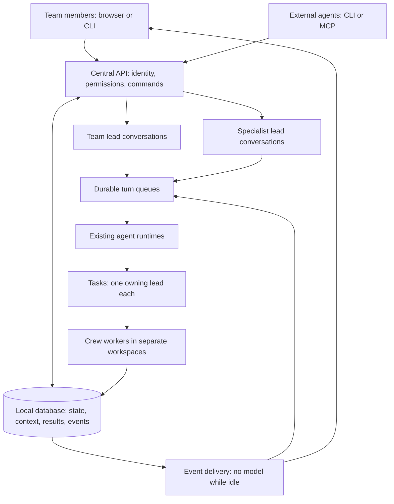

# Team leads on one central installation

Design proposal · 21 September 2026 · implementation has not started.

The confirmed audience is a team using one central Standing Orders installation. Preserve Chat, Tasks and Projects. Default to one shared team lead; add specialist leads only when their responsibilities, project access or working instructions differ. People connect to the central service through browser or CLI. The service owns the database, execution sessions and delivery bookkeeping.

The product promise is simple: ask once, see who is handling it, leave and return without losing work, and hear back when there is a result or a decision. A second person or device joins the same work rather than starting another agent copy.

## 1. Architecture and identity



Distinguish five things that are currently partly coupled:

| Concept | Meaning | Lifetime |
| --- | --- | --- |
| Person | An individually authenticated teammate | Independent of device/login renewal |
| Lead | A named role with instructions, project access and standing permissions | Independent of a credential or provider process |
| Conversation | Messages shared with a specific audience, directed to one lead | Persists across devices and agent restarts |
| Execution session | A provider thread and its workspace/checkpoints | May be interrupted, resumed or replaced |
| Task | A durable outcome with one owning lead and its crew attempts | Keeps its identity through revisions and handoffs |

A lead can have several conversations. Each conversation has its own provider history, context boundary and turn queue. A shared lead must not reuse hidden context from a private conversation. Multiple people do not get separate agent copies merely by opening the same conversation.

Different conversations and leads can work concurrently, subject to runner capacity and budgets. The one-writer rule applies per conversation/provider session, not to the entire installation or to every conversation created by the same person.

## 2. What exists and what must change

Baseline inspected: canonical source `fae73c47f7487f45de069217bc9d75e0f6bda6e1`; this design makes no runtime change.

| Existing implementation | Reuse | Required change |
| --- | --- | --- |
| Accounts and project access in `store.ts`, `project-access.ts` | Authentication, account generation, project restrictions | Add conversation membership and independent lead identity |
| Mate sessions/threads/turns in `store.ts`, `mate.ts` | Stored messages, command receipts, spend admission and guarded actions | Replace one-live-turn-per-approver with per-conversation admission; retain credential/account budget limits |
| `SessionService` and `CodingWorkspace` | Expected revisions, durable request IDs, native thread identity and recovery | Keep private sessions private; support explicit shared execution grants only after runner isolation is established |
| Assignment ownership and delivery | One accountable owner, exact results, issued batches and acknowledgments | Bind ownership to a stable lead rather than its replaceable coordinator credential |
| `lead-follow.ts` | No-model idle scans, coalesced updates, saved response reuse | Independent subscriptions per lead/conversation, event routing and optional external wake adapters |
| `lead-context.ts`, repository context and knowledge | Bounded DB catch-up, saved task context and source retrieval | Scope every context snapshot/cache to conversation audience and permissions |
| Paginated work index and conditional chat refresh | Cheap lists, exact counts, bounded detail | Shared read projections, change streams and concurrent-client load verification |

Current native coding sessions are owner-and-generation private. Their HTTP endpoint requires instance-operator access, and the provider subprocess uses the host's native authentication/configuration. Adding a member list is insufficient to make those sessions safely shareable. Team task coordination can ship before shared direct coding sessions.

## 3. Team interaction

Keep the current visual language. This is an Operate surface: the conversation, current outcome and next action take priority over an agent-management dashboard.

**Default:** Chat opens the team lead and the last conversation the person used. A compact lead selector appears when more than one lead is available. The header shows the conversation title and a clear audience label, such as **Team · Website** or **Private**. People and access settings live behind that label.

**Multiple people:** Alex asks for a settings-page change; Sam adds an acceptance criterion in the same conversation. Each message shows its author. The server saves both immediately and runs them in order. While a turn is active, the second message says **Queued**. The author can edit or withdraw their queued message with a revision check. Editing invalidates the queued processing snapshot; the worker cannot execute an older version after a successful edit.

**Conflicting instructions:** the lead surfaces one concrete choice and routes it to the named task owner/authorized decision maker. Message arrival order establishes processing order, not who has greater authority. A later message cannot silently broaden approved scope, cancel a teammate's work or reverse an accepted decision.

**Direct interruption:** Send queues a follow-up by default. A separate **Stop** control is available to authorized participants and reports whose turn it affects. Defer live steering during a running turn until provider support and command delivery are explicitly represented; do not pretend a queued message reached a running model.

**Results:** task cards show one status, a short outcome, the owning lead and one primary action. Ready offers **Open result**. The exact result offers **Mark complete** and secondary **Request changes**. Real check failures remain visible. A sufficiently authorized lead may inspect and complete the exact result under its saved grant; there is no separate mandatory model reviewer or evidence repair loop.

**Notifications:** notify the requester, responsible lead and explicitly subscribed teammates. Joining a room does not subscribe a person to every task in the installation. Present one meaningful update per result/decision change; keep step-by-step activity in details. Read/unread progress is personal, while delivery to the lead is shared.

**Phone:** a single conversation column, lead selector in the header, tasks and participants in sheets, and one sticky composer. Show Queued beside the saved message, not as a page-blocking error. Preserve a person's draft when switching leads. Do not place diagnostics, budget controls or participant administration beside Send.

**Desktop:** the same hierarchy, with an optional task detail panel. Presence is informational; it never determines permission or ownership. No multiplayer cursors, shared draft editing or mandatory spatial board in the first version.

**CLI:** select the central server and sign in as yourself once. List available leads, attach to an existing conversation, read a DB-backed brief, and use the existing task commands. Proposed additions below are illustrative interface contracts, not shipped commands:

```sh
standing-orders connect https://your-server
standing-orders lead list
standing-orders chat --lead engineering --conversation settings-page
standing-orders brief --lead engineering --json
standing-orders task list --lead engineering --view needs-you --json
```

`connect` establishes a server profile and an authenticated sign-in flow; credentials never appear in command history. A server-resolved conversation ID is the durable identity behind a friendly selector. Ambiguous selectors return choices without creating a conversation. Attaching or running `brief` does not start a model turn. Reuse `chat --follow` for receiving updates; it must not create repeated empty messages. Machine responses distinguish saved, queued, running, finished and delivery-unconfirmed commands and return the same IDs used by the UI. Account identity, project scope and queued messages remain visible across both surfaces.

## 4. Permissions and shared context

Reuse existing account roles and project access. Add simple conversation roles: **Viewer**, **Contributor**, **Manager**. Contributor permits messages and proposals, not execution approval. Manager controls membership and conversation settings, but cannot grant project rights they do not own. Execution, completion, publication and deployment retain their existing separate authority requirements.

Every command records the authenticated initiator, acting lead, conversation, credential, request ID and exact object revision. The server derives these identities; a model or client cannot choose an arbitrary acting person.

For a human-triggered action, effective authority is the intersection of the person's current rights, lead grant, conversation scope and existing action-specific grant. An automatic action uses an explicit standing grant with its issuer, scope and limits; another teammate's presence supplies no additional authority. Revoked grants stop further actions even if a turn was queued earlier.

Choose the conversation's project scope explicitly. Every member must be allowed to see that entire scope and its history. Admission of new members is checked against the history's provenance, not only the latest project selection. Do not narrow a broad conversation and assume its existing model history is now safe for a narrower audience. Create a fresh conversation/provider thread with an explicitly selected safe brief when audiences or scopes are incompatible.

Keep private and shared conversations separate. Forwarding an exact result or a selected knowledge item is an explicit, authorized action; joining the same lead never merges private histories. Knowledge promotion records source, scope, editor and revision. Model summaries remain contextual data rather than new standing permissions.

Permission changes invalidate cached responses, context snapshots and active subscriptions. At model/tool admission and before delivery, recheck current rights. Removed members lose new access without deleting team history. Already delivered content cannot be retracted; server revocation cannot erase what a recipient previously read.

Workspace provider credentials require an explicit administrator grant covering projects, permitted operations, concurrency and spend. Show whose account funds shared execution. Personal provider credentials and private native threads are not shared implicitly. Project-scoped native execution also needs filesystem, process and secret isolation; retain the current instance-operator restriction until that is implemented and verified.

## 5. Durable commands and stateful execution

Browser, remote CLI, MCP and automation adapters call the same domain operations. The central service holds SQLite locally; client machines do not mount or open its database. Keep direct local database commands for controlled administration/migration, not ordinary remote team writes.

A proposed command envelope includes `requestId`, conversation and target IDs, expected revision, operation and arguments. Authenticated actor, lead identity, effective grant and runtime generation are attached by the server. Reusing the same request ID and payload returns its recorded outcome; reusing it with different content is rejected.

Save a message/command before acknowledging it. Admit queued turns atomically, with one active writer per conversation and a durable generation fence. A restarted or displaced worker cannot commit a new action or response under an older generation. Database fencing protects accepted writes; process supervision must also establish that an old native writer has exited before starting a replacement. Expiry alone is not proof that an external side effect or process stopped.

Carry the turn's stable action ID through downstream operations. Network timeout means inspect the receipt and reconcile provider state; it does not mean create another turn/task or repeat an external effect. Delivery can be retried with the same identity. An ambiguous non-idempotent effect stays **Delivery unconfirmed** with **Inspect activity**, instead of claiming exactly-once execution or automatically resubmitting work.

Keep persistent provider threads and workspaces where supported. Save explicit execution state: provider/thread binding, branch/base, working directory, artifact references, accepted commands, known outcomes and a bounded catch-up. Files, database records and checkpoints are durable; a dead shell's variables or an interpreter's heap are not promised to survive a restart.

Use existing provider/runtime adapters. Add capability descriptors for resume, interruption, tool restrictions and confirmed request delivery so the UI only offers supported behavior. A small typed command boundary is useful now; a universal Bash/TypeScript compiler or a new orchestration engine is outside this design.

## 6. Reliable events without empty agent wakeups

Use the existing action ledger, assignment status and outbox infrastructure. Extend the underlying domain transactions to record typed, durable change events for committed results, decisions, ownership and membership changes. Inventory actual event producers first: current observer scans can miss intermediate states and must not be mislabeled as transactional event delivery. Keep bounded deterministic reconciliation for legacy producers and recovery.

Converge the current assignment-status and built-in follow observations onto one change stream with independent consumer cursors. Retain human notification receipts separately. Do this incrementally behind the existing adapters; do not introduce a third scanner, a second task state machine or a new queue service.

Route changes to lead/conversation subscriptions. Separate four records of progress: source event committed, consumer batch issued, lead response durably handled, and human message read. A delivery acknowledgment never means task completion. Different users/devices have independent read cursors; instances of the same logical lead share its processing state and use a worker claim.

Batch related changes, refresh current task state before deciding what to surface, and save one response request identity. Superseded updates may be summarized; unresolved failures or decisions may not disappear. Events that occur during a running turn remain queued for a later turn. A successful response followed by a lost acknowledgment is recovered from its receipt without another model call.

Idle supervision is ordinary program code. It may poll a local cursor, but it emits no chat messages and invokes no model when nothing needs judgment. Routine status cards can also be produced without a model. Use the model for synthesis, decisions or authorized next actions.

For browser/CLI viewers, use an authenticated server-sent event stream with resumable cursors and bounded catch-up; use ordinary requests for mutations. An event is a hint to refresh a scoped projection, never execution authority. Slow/disconnected clients reconnect from a cursor or receive a fresh snapshot. Cursor scope includes permissions and filters; an expired cursor produces a fresh scoped snapshot rather than unlimited replay. Never send credentials in stream URLs.

An external lead connector must declare whether it can wake an existing agent session, deduplicate requests and return durable receipts. If it cannot, show pending updates for the next explicit connection. Do not replace that missing capability with repeated scheduled model turns. The paused Codex watcher stays paused; this design does not assert that external event-triggered wake is already available.

Reconnect/transport retries never dispatch crew work, manufacture missing evidence or request a model review. An actual failed lead turn is retained and surfaced once; continuation is a new authorized user request, not an endless automatic retry loop.

## 7. Multiple leads and shared resources

Start with one **Team lead**. Optional examples are **Product** and **Engineering**, with explicit responsibilities and allowed projects. The project can suggest a default lead; every conversation still names its active lead. Sending a message to one lead must not broadcast it to all leads.

Each task has one `ownerLeadId` and an ownership revision. Observers can subscribe without claiming it. Transfer uses an expected revision and records both the old and new owner; the receiving lead must be authorized for the task's scope. A handoff changes responsibility, not the task ID, approved scope, run history or current crew execution. A crew attempt keeps its existing execution lease.

Leads collaborate through referenced tasks, results and narrow questions. Reuse an existing task/result when applicable. Store causation IDs and directed recipients; reject dependency cycles and suppress reply-to-notification loops. Distinct leads proposing apparently similar work should expose that overlap for a decision rather than automatically deleting or merging tasks based on an LLM similarity judgment.

Use separate worktrees for concurrent edits. Serialize only truly shared mutations, such as updating one target branch or deploying one environment, through an existing resource owner or a narrowly scoped lease. Do not lock an entire repository for independent worktrees. A stalled deployment must not stall unrelated lead conversations.

Schedule runnable turns fairly across leads, with per-lead and installation/provider capacity and budget reservations. Human requests take priority over background summaries, while aging prevents starvation. No new time limit terminates legitimate agent work; queue admission, Stop and existing process recovery remain explicit. Attribute usage to both the requesting person and the acting lead, with the funding grant recorded.

## 8. Additive data changes

These are logical records to fit into existing tables/services during implementation, not instructions to create a parallel task database.

| Record/change | Essential fields or invariant |
| --- | --- |
| Lead | Stable ID, name, instructions revision, active/paused state, default execution profile |
| Lead projects and members | Existing project/account IDs, scoped rights and membership revision |
| Conversation and participants | Lead ID, explicit audience/project scope, scope revision, participant roles and personal read cursor |
| Message metadata | Author kind/ID, sequence, causation ID, request ID, source channel; extend existing message storage |
| Turn admission | Conversation ID, queued message revision, expected state, generation, runner claim and saved receipt; extend mate turns |
| Execution binding | Conversation, provider thread, workspace, runtime/build identity, context/scope revision and grant |
| Assignment owner | Stable lead ID, ownership revision, historical credential/actor retained in audit |
| Subscription/delivery | Recipient lead/conversation, event cursor, exact issued batch, receipt and current authorization binding |
| Context snapshot | Conversation scope, source revisions, included records, omissions and cache identity |

Extend existing uniqueness constraints for admission, message IDs, task ownership and result completion rather than relying on in-memory locks. The native coding catalog and main task database currently have separate persistence boundaries; use a durable command intent plus reconciliation if an operation crosses them. Do not promise one atomic transaction across unrelated stores or a database and external provider.

## 9. Performance and deployment shape

Keep one central service and local SQLite for the first team version. SQLite supports server-side application use, but one database has one writer at a time; keep transactions short and avoid network/provider calls while holding a write transaction. WAL requires the database processes on the same host and is unsuitable for sharing the file over a network filesystem. [SQLite deployment guidance](https://www.sqlite.org/whentouse.html), [WAL documentation](https://www.sqlite.org/wal.html).

Reuse 40-row task pages, bounded history, lazy artifacts and indexed project filtering. Route one recorded change to relevant subscribers instead of running a complete project scan for every viewer or lead. Cache projections by authorization scope/revision and query, never merely by URL. A per-user read marker must not invalidate the full team workspace. Streaming tokens remain ephemeral/coalesced UI activity; save final messages and meaningful progress without creating one lifecycle event per token.

Keep context bounded: last accepted goal, unresolved decisions, relevant task changes since the conversation cursor, and targeted knowledge/source excerpts. Fetch large logs and artifacts on demand. Cross-lead handoffs send references and a short scoped brief, not a concatenation of private transcripts. Context caches cannot grant access or override source freshness.

Proposed load fixture: 20 people, 10 logical leads, 50 connected clients, 100 projects and 10,000 tasks. These are acceptance targets, not verified capacity claims. Measure idle, burst messaging, task completions, reconnects and concurrent background work.

Targets on the release machine: zero idle model calls/messages; no duplicate accepted commands; p95 message persistence acknowledgment below 250 ms; p95 warm task pages below 750 ms under the fixture; meaningful status visible within 2 seconds on a healthy connection, excluding model-generation time. Fresh chat currently measured p95 about 1.6 s on the earlier large fixture: aim below 1 s by reducing repeated global projection work before claiming improvement. Record query latency, write-lock wait, queue age and model calls per meaningful event.

Postgres is a later option if measured write contention or a requirement for multiple active server hosts exceeds this design. Client count alone does not require a database migration. Keep one active runtime owner per native session even if web serving is later replicated. [SQLite concurrency guidance](https://www.sqlite.org/whentouse.html#high_concurrency).

## 10. Failure behavior

| Situation | User experience and invariant |
| --- | --- |
| Two teammates send at once | Both saved with author attribution; one runs, one is Queued |
| Browser/CLI resends after timeout | Same request returns its prior receipt; no second task/turn |
| Two people act on the same result | First valid revision wins; the other sees the current result/decision |
| An old lead returns after handoff | Ownership fence prevents new owner-only actions; saved history remains readable to authorized people |
| Service stops after provider send | Recover recorded provider/request state; uncertain delivery is inspected before any resend |
| Permission revoked while queued/running | Stop new admissions/tool actions and delivery; request supported cancellation, retain history and disclose any already-started effect |
| Member leaves or key rotates | Future authority ends; shared history and past completion do not vanish |
| Provider or budget unavailable | One clear waiting reason; preserve messages and show the authorized next action |
| Notification connection fails | Retain delivery cursor/batch; task remains in its actual state |
| Scope/knowledge has changed | Read current authorized context; invalidate stale action cards; preserve original crew context |
| Lead reply fails | Show the saved failure once; crew work is not rerun |

## 11. Delivery sequence

1. **Identity and migration foundation.** Stable lead IDs and credential bindings, private conversation backfill, per-author messages and membership model. Preserve audit, old task IDs, grants, results and history. No automatic sharing.
2. **Durable turn admission and quiet delivery.** Queue per conversation, generation checks, existing receipt reuse, independent lead subscriptions and transactional events where producers permit. Keep deterministic reconciliation and no-model idle behavior. External wake remains capability-gated.
3. **Shared team conversations.** Invite/join, author attribution, queued follow-ups, scoped catch-up, remote CLI attachment and personal read state through the same services. Team coordination uses existing approved crew execution. Shared direct native coding remains restricted until execution isolation is proven.
4. **Multiple leads.** Lead selector, project defaults, explicit ownership transfer, fair scheduling, narrow handoffs and shared-resource mutation protection. Add workload/budget views behind lead settings.
5. **Load and release.** Exercise failures and team load, inspect the desktop/phone journey, then use the normal exact-candidate native gate and checked deployment. Verify UI, worker and CLI agree on the installed build.

Use bounded implementation slices and existing focused suites. Do not create thousands of mirrored UI tests or a new review/evidence workflow. This proposal itself requires no provider run, full test suite, database migration or deployment.

## 12. Migration and acceptance checks

Legacy conversations remain private to their original person. Create a fresh shared conversation/provider thread from explicitly selected safe context. Bind each legacy coordinator credential to an individual lead initially; combining identities is a deliberate operation. Preserve historical credential IDs in audit.

`closeMateThreadsFor()` currently deletes messages/proposals, while access changes rotate account generation. Membership removal must use a new scoped revocation path, not close a shared thread. Existing completion presentation can depend on the owner's current credential/access: separate historical accepted-result facts from future action authority, retaining provenance checks and later task revisions. A token rotation must not recreate completed work as a new result needing attention.

Back up the main database and native coding catalog consistently during the normal drain. Introduce recognized schema changes with authentic historical fixtures and compatibility checks; old binaries must refuse unsafe writes. Validate row counts, task/result identities, private visibility and queued request preservation. Restore the matching runtime/data backup together only during a quiescent rollback; do not overwrite work accepted after a new runtime goes live.

Minimum focused regressions: simultaneous messages and edit/admission race; same-ID replay and changed-payload rejection; two approvals/completions racing; expired writer with a live old process; event before crash and reply before lost ACK; two leads owned by one person; transfer during a pending result; revoked participant/subscription; private-to-shared context isolation; mixed-project notification; token rotation with an already-complete task; user departure without history deletion; native/task-store reconciliation.

One desktop and one phone acceptance journey: Alex asks, Sam adds a queued requirement, a crew result arrives, an authorized participant opens the exact result, leaves realistic feedback, and creates one revision. Include empty rooms, long messages/titles, permission loss and unconfirmed delivery. Verify keyboard access, readable contrast, 44-pixel targets, no horizontal overflow or composer overlap, and clear authorship. These are planned checks; this design has not been implemented or visually validated.

Simplicity pass: keep Chat/Tasks/Projects; one default lead; explicit audience; author names; one primary action per state. Put credentials, receipts, runtime details, quotas and membership administration behind appropriate controls. Do not show repeated “checking for updates” messages, add a mandatory review stage or hide real failures.

## Source anchors

- Current product flow: [shared lead modernization](shared-lead-modernization.md), [project context](../PROJECT_CONTEXT.md).
- Current scaling behavior and measured limits: [fast task views](../scalable-task-views.md).
- Account/project checks and mate schema/admission: `src/store.ts:1961`, `:9343`, `:20013`, `:20045`, `:20189`; `src/project-access.ts`.
- Private native sessions and instance-operator restriction: `src/coding-workspace.ts:110`, `src/session-server.ts:19`, `src/coding-provider.ts:74`.
- Assignment ownership/completion: `src/assignment.ts:67`, `:191`, `:268`; delivery: `src/assignment-delivery.ts:81`, `:129`.
- Follow grants and saved response handling: `src/lead-follow.ts:43`, `:122`; DB context: `src/lead-context.ts`.
- Inspiration: [Tobi's persistent execution environment post](https://x.com/tobi/status/2101832189469929494). This proposal adopts durable state and shared adapters without claiming to implement his proposed universal execution runtime.
